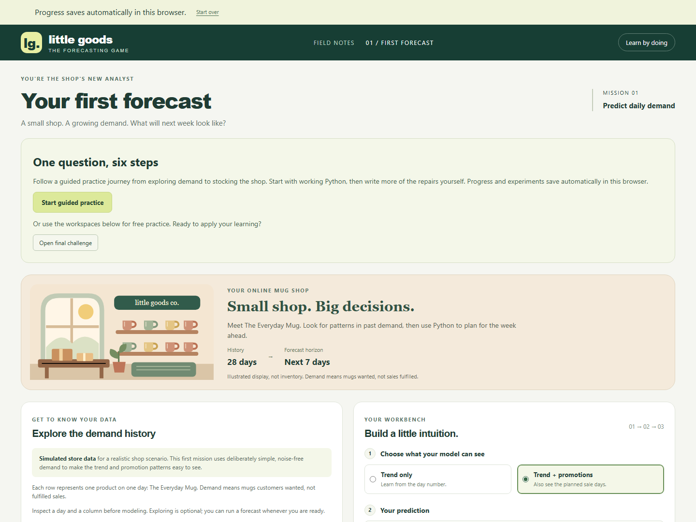
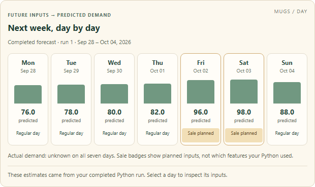

# Little Goods

**Learn forecasting by running a small shop.**

Little Goods is a data science game for people who know basic Python and pandas. Study demand, write a forecast, compare it with a baseline, and decide how many mugs to stock. Watch the shop sell what you ordered, then inspect lost sales, leftovers, and profit.

[Download the Windows preview](https://github.com/zerowing113/data_science_game/releases/tag/offline-v0.1.0-preview.3) · [Run from source](#run-from-source) · [Report a problem](https://github.com/zerowing113/data_science_game/issues)



*The shop and modeling workspace.*

## What you do

One mission takes you through the main steps of a forecasting project:

| Activity | What you practice |
|---|---|
| Explore demand | Read daily observations, spot patterns, and inspect upcoming inputs. |
| Write a forecast | Edit Python and predict the next seven days with pandas and scikit-learn. |
| Evaluate the model | Train on earlier days and compare model and baseline errors on the same later days. |
| Repair missing data | Inspect missing values and learn a replacement value from training data. |
| Check feature timing | Identify information unavailable when making a forecast. |
| Stock the shop | Commit daily orders and see how forecast errors affect sales and profit. |
| Complete the challenge | Apply your approach to fresh data and explain your decisions. |

Charts, daily tables, feature timelines, and shop animations connect your code to its results. Guided practice provides optional hints. You write the repair code and complete the final challenge yourself.

Python runs in the browser through Pyodide. Forecasts come from your code. Your code, attempts, results, and progress save automatically in the current browser profile.



*Forecast results from the trend and promotions model.*

## Download and play on Windows

The current release is **preview 3**, an unsigned test build for Windows 11 x64.

1. Download `little-goods-0.1.0-windows-x64.zip` from the [release page](https://github.com/zerowing113/data_science_game/releases/tag/offline-v0.1.0-preview.3).
2. Extract the entire ZIP into a folder.
3. Set Chrome as your default browser, then open **Start Game.exe**.
4. Choose **Start guided practice**.

The package includes the game and Python dependencies. Players do not need Node.js, a Python installation, a terminal, or an account. It serves the game locally at `http://127.0.0.1:43127` and is designed to work without internet access.

**To stop:** click **Stop game** inside the app. Closing the browser alone leaves the local server running. If another instance is reported, reopen the local address and stop the existing game before launching the replacement.

**To resume:** open Start Game again using the same browser profile. Changing browsers or profiles, using private browsing, or clearing site data can make saved work unavailable. See the [player guide](docs/offline-player-guide.md) for updates and recovery.

## Platform status

| Platform | Current status |
|---|---|
| Windows 11 x64 | Preview available. A Windows/Firefox online launch was reported successful; full offline device acceptance is pending. Chrome is the recommended test browser. |
| macOS, Apple Silicon | **Preview 3 has a confirmed launch blocker.** A MacBook Air M4 reported a damaged-app warning. The bundle-signature defect is repaired in source, but no replacement download has been accepted for normal launch. |
| macOS, Intel | Native automated tests passed. Normal downloaded-app acceptance remains unverified; no Intel test device is available to the owner. |

Mac distribution still needs Developer ID signing, notarization, and device testing. The existing Mac downloads should not be treated as ready for normal use. See the [Mac diagnosis](docs/reviews/macos-bundle-integrity.md) for the verified defect and remaining work.

Preview 3 passed **51 browser tests on each native target**, plus launcher, offline Python, and process-restart checks. Those tests execute the packaged application; they do not establish Finder/Explorer launch acceptance. [Release verification](docs/reviews/offline-preview-3.md)

The complete mission is implemented. [Device acceptance (#10)](https://github.com/zerowing113/data_science_game/issues/10) and the [observed learner playtest (#11)](https://github.com/zerowing113/data_science_game/issues/11) remain open.

## Run from source

Requires **Node.js 22.12 or newer** and npm. Initial setup downloads the bundled Python runtime and packages. No separate Python installation is needed to run the game from source.

```sh
git clone https://github.com/zerowing113/data_science_game.git
cd data_science_game
npm ci
npm run prepare:python
npm run dev
```

Open the local address printed by Vite, normally `http://127.0.0.1:5173`.

## Development and tests

The application uses React, TypeScript, and Vite. Pyodide runs pandas and scikit-learn in web workers. A small Go launcher embeds the production application for downloadable builds.

After preparing Python, run:

```sh
npx playwright install chromium
npm run typecheck
npm run test:forecast
npm test
npm run build
```

Browser tests use real Python execution through the learner interface. The teaching data is deliberately simple; its scores do not represent expected accuracy on real business data.

## Documentation

- [Player guide](docs/offline-player-guide.md): launch, stop, resume, and replace a build.
- [Build and packaging](docs/offline-build.md): toolchains, native packages, and verification.
- [Device test procedure](docs/offline-acceptance.md): offline launch and saved-progress checks.
- [Learner observation guide](docs/learner-playtest.md): timing, assistance, and understanding.
- [Mission reference](docs/mission-reference.md): detailed rules, Python contracts, and fixture answers.
- [Local save design](docs/adr/0002-local-journey-save.md): what is stored and how recovery works.

Found a problem? [Open an issue](https://github.com/zerowing113/data_science_game/issues) with the release, OS and browser versions, steps to reproduce, and the exact error or a screenshot.
